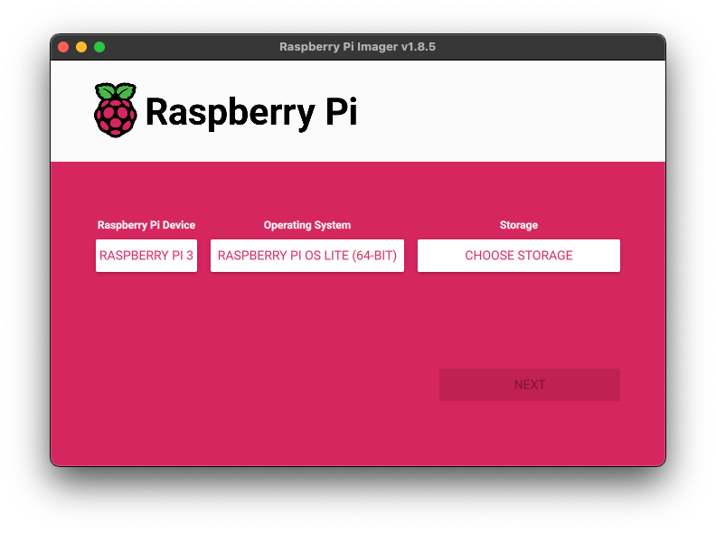
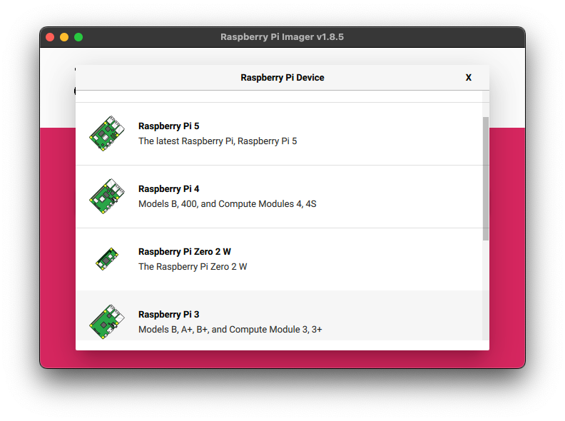
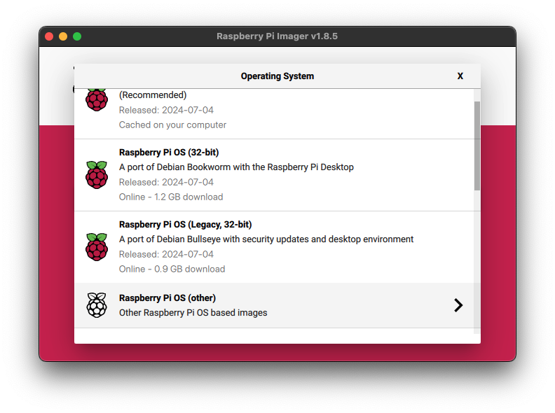
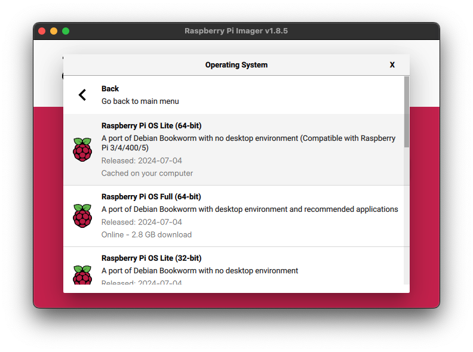
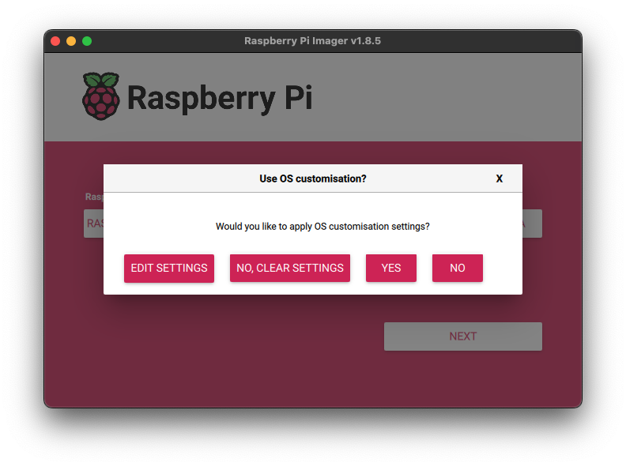
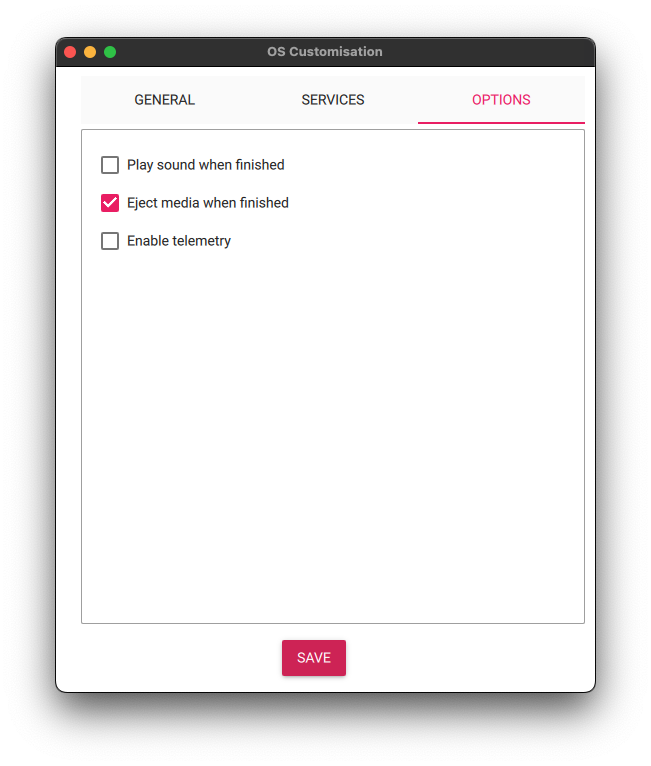
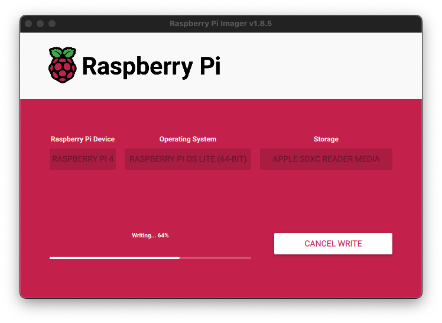

# styx-os

## Features
- Wireless Access Point (via `hostapd`)
- Ad blocking for all connected devices (via `Pi-hole`/`dnsmasqd`)
- Deep Packet Inspection for connected devices
- API for accessing reports on monitored network traffic

## Requirements
- Raspberry Pi 3, 4, or 5
- Ethernet network connection
- Base Raspberry Pi OS installation
  - 64 bit version
  - "Lite" image preferred

## Instructions
- Install Raspberry Pi OS ([see below](#os-installation))
- Log into console directly or via SSH

- Automated installation:
  - Install dependencies
  - Build software
  - Deploy containers
  - Start services

### Default Installation
```shell
curl -sL setup.styx.jigsaw.studio | sh
```

### Custom Installation
The following optional command line parameters can be used to customize your styx-os installation:
- `--user`: The username under which to run the various styx-os software services (default: "[styx](https://github.com/Jigsaw-Studio/styx-os/blob/main/setup.sh#L12)")
- `--ssid`: The SSID broadcast name for the wireless access point (default: "[Styx](https://github.com/Jigsaw-Studio/styx-os/blob/main/setup.sh#L14)")
- `--wpa`: The WPA passphrase for the wireless access point (default: [[hidden](https://github.com/Jigsaw-Studio/styx-os/blob/main/setup.sh#L15)])
- `--web`: The password for the Pi-hole administrative web interface (default: [[hidden](https://github.com/Jigsaw-Studio/styx-os/blob/main/setup.sh#L16)])
- `--branch`: A different [branch](https://github.com/Jigsaw-Studio/styx-os/branches) for installing development versions of styx-os (default: "[main](https://github.com/Jigsaw-Studio/styx-os/blob/main/setup.sh#L13)")

#### Example (custom SSID name):
```shell
curl -sL setup.styx.jigsaw.studio | sh -s -- --ssid Styx
```

#### Example (All custom settings):
```shell
curl -sL setup.styx.jigsaw.studio | sh -s -- \
  --user styx \
  --ssid Styx \
  --wpa "StyxWiFiPassword" \
  --web "Pi-holeWebAdmin"
  --branch v1.1.1
```

### Access (Defaults)
- Wireless Access Point
  - SSID: [Styx](https://github.com/Jigsaw-Studio/styx-os/blob/main/setup.sh#L14)
  - Password: ([hidden](https://github.com/Jigsaw-Studio/styx-os/blob/main/setup.sh#L15))
- Pi-hole
  - Web Interface: http://172.16.100.1/admin (replace `172.16.100.1` with your Raspberry Pi's IP address)
  - Password: ([hidden](https://github.com/Jigsaw-Studio/styx-os/blob/main/setup.sh#L16))
- API
  - Documentation: http://172.16.100.1:8192/redoc (replace `172.16.100.1` as necessary)

### OS Installation
- [Raspberry Pi Imager]((https://www.raspberrypi.com/software/)) is an easy way to perform an OS installation
  - [Download link](https://www.raspberrypi.com/software/)
  
- Select your model of Raspberry Pi Device
  
- Choose "Lite" version of Operating System to minimum storage usage
  - Scroll down to "Raspberry Pi OS (other)"
    
  - Choose Raspberry Pi OS Lite (64-bit)
    
- Insert Micro SD card into your system using a SD or USB adapter
- Under "Storage" choose your device
- Click Next
- When prompted, "Edit Settings" to save time post-installation.
  
  - Enter the following settings under "General"
    - Hostname (choose any name)
    - Username (*NOTE*: If not using "styx" please see [Custom Installation](#custom-installation))
    - Timezone
    - Keyboard layout
    - (*NOTE*: it is *not* necessary to configure wireless LAN for this step)
      
  - Under "Services" make sure to "Enable SSH" for remote access
  - For privacy reasons, you may wish to disable "Enable telemetry" under "Options"
    
  - Click "Save" to confirm your changes
  - Click "Yes" to apply your customizations
- Click "Yes" to begin writing the OS image to your device
- Raspberry Pi Imager will write the image, verify it, and notify you when finished
  

## Credits
- [Pi-hole](https://pi-hole.net/): [Github](https://github.com/pi-hole) | [Donate](https://pi-hole.net/donate/) 
- [AutoWLAN](https://gitlab.com/hartek/autowlan) by Guille Hartek
