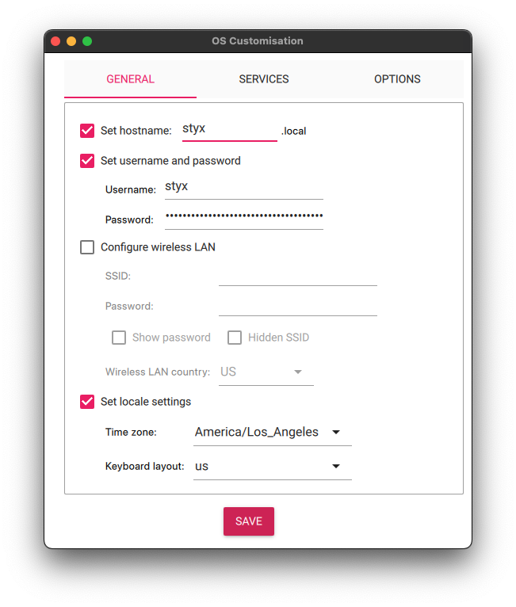

# styx-os

## Features
- Wireless Access Point (via `hostapd`)
- Ad blocking for all connected devices (via `Pi-hole`/`dnsmasqd`)

## Requirements
- Raspberry Pi 3, 4, or 5
- Ethernet network connection
- Base Raspberry Pi OS installation
  - 64 bit version
  - "Lite" image preferred

## Instructions
- Install Raspberry Pi OS ([see below](#-os-installation))
- Log into console directly or via SSH

- Automated installation:
  - Install dependencies
  - Build software
  - Deploy containers
  - Start services
```shell
curl -sL setup.styx.jigsaw.studio | sh
```

### OS Installation
- [Raspberry Pi Imager]((https://www.raspberrypi.com/software/)) is an easy way to perform an OS installation
  - [Download link](https://www.raspberrypi.com/software/)
  
- Select your model of Raspberry Pi Device
  
- Choose "Lite" version of Operating System to minimum storage usage
  - Scroll down to "Raspberry Pi OS (other)"
    
  - Choose Raspberry Pi OS Lite (64-bit)
    
- Insert Micro SD card into your system using a SD or USB adapter
- Under "Storage" choose your device
- Click Next
- When prompted, "Edit Settings" to save time post-installation.
  
  - Enter the following settings under "General"
    - Hostname (choose any name)
    - Username (*NOTE*: "styx" is currently *required* as username)
    - Timezone
    - Keyboard layout
    - (*NOTE*: it is *not* necessary to configure wireless LAN for this step)
      
  - Under "Services" make sure to "Enable SSH" for remote access
  - For privacy reasons, you may wish to disable "Enable telemetry" under "Options"
    
  - Click "Save" to confirm your changes
  - Click "Yes" to apply your customizations
- Click "Yes" to begin writing the OS image to your device
- Raspberry Pi Imager will write the image, verify it, and notify you when finished
  
